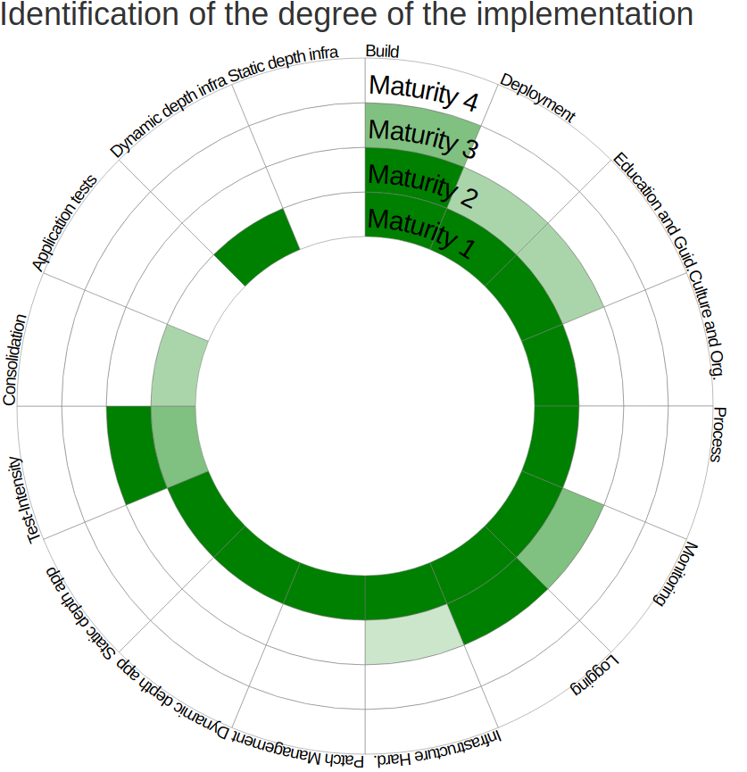

# DevSecOps Pipeline

### Dev
    - Pre-commit hooks
    - IDE plugins
### Code Repository
    - Secret Management
### CICD
    - SAST - Static Application Security Testing
    - SCA - Software Composition Analysis
### BUILD
    - Image Scan
### Staging / QA 
    - DAST - Dynamic Application Security Testing
    - Vulnerability Management
    - IAST - Interactive Application Security Testing
    - RASP - Runtime Application Security Protection
### Production
    - Compliance as Code
    - Security in IaC
    - VA
    - Pentesting
### Monitoring
    - RUM
    - APM
    - Alerts
    - Metrics
    - Logs

### OWASP DSOMM - DevSecOps Maturity Model

[READ about DSOMM](https://owasp.org/www-project-devsecops-maturity-model/)

4 levels of maturity model

1. Basic Understanding of Security Practices
2. Adoption of Basic Security Practices
3. High adoption of Security Practices
4. Advance Deployment of Security Practices at Scale

[Achieve the maturity model with the dsomm recommendation matrix](https://dsomm.owasp.org/)

